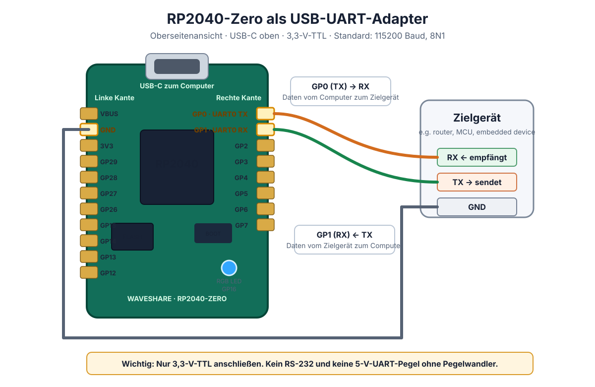

# RP2040-Zero Dual-CDC UART Adapter

> 🇬🇧 **English** · [🇩🇪 Deutsch](#deutsch)

[](../../actions/workflows/build-firmware.yml)


[](LICENSE)

Turn a **Waveshare RP2040-Zero** into a compact USB-to-TTL-UART adapter. It
exposes two separate USB serial ports: one strictly for diagnostics and one
strictly for UART payload. The built-in RGB LED reports the adapter state
without requiring a terminal.

This project is for makers, embedded developers, repair technicians, and
anyone who needs a transparent 3.3 V UART console for a microcontroller,
router, single-board computer, or other embedded device. It is **not** an
RS-232 adapter and must never be connected directly to 5 V TTL or ±RS-232.

## 🚀 Quick start — CircuitPython (primary firmware)

The primary and recommended implementation is CircuitPython. The exact
tested board firmware is included in
[`firmware/adafruit-circuitpython-waveshare_rp2040_zero-en_US-10.3.0.uf2`](firmware/adafruit-circuitpython-waveshare_rp2040_zero-en_US-10.3.0.uf2).

1. Hold **BOOT** on the RP2040-Zero and connect it by USB. The `RPI-RP2` drive
   appears.
2. Copy the supplied CircuitPython `.uf2` from `firmware/` to `RPI-RP2`.
3. After the automatic restart, a `CIRCUITPY` drive appears.
4. Copy [`circuitpython/boot.py`](circuitpython/boot.py) and
   [`circuitpython/code.py`](circuitpython/code.py) to the **root** of
   `CIRCUITPY`, replacing the example `code.py` if it exists.
5. Safely eject or reconnect the board. Its LED is solid blue when the bridge
   is ready.

```text
CIRCUITPY/
├── boot.py
└── code.py
```

`boot.py` creates two separate USB serial interfaces. `usb_cdc.console` is the
CircuitPython REPL and diagnostics port; `usb_cdc.data` is the UART bridge.
On a typical Linux host they enumerate as two `/dev/ttyACM*` devices; verify
the port before opening it and use the data interface for UART traffic.

## ✨ Highlights

| Feature | Benefit |
| --- | --- |
| Dual USB CDC | Debug/REPL and bridge payload are isolated, so diagnostics cannot corrupt UART data |
| 3.3 V TTL UART | UART0 on `GP0` / `GP1`; default: 115200 baud, 8N1 |
| Visual status | Solid blue means ready; directional traffic pulses at 4 Hz |
| Primary firmware | CircuitPython image and ready-to-copy board files included in this repository |
| Optional C++ path | Pico SDK implementation for users who prefer compiled firmware |
| Boot capture | Exact bytes and a readable timestamped log, with Python standard library only |
| Tagged builds | GitHub Actions builds the Pico SDK firmware from version tags |

## 🧰 Hardware and wiring

| RP2040-Zero pin | UART role | Connect to target |
| --- | --- | --- |
| `GP0` | UART0 TX — adapter sends | Target RX |
| `GP1` | UART0 RX — adapter receives | Target TX |
| `GND` | Signal reference | Target GND |

Connect TX and RX crossed. **A common GND connection is mandatory.**



See the [wiring guide](docs/wiring.md) for pin notes and source material.

> [!WARNING]
> This adapter uses **3.3 V logic levels only**. Do not attach it directly to
> a legacy RS-232 port, often ±12 V, or to a 5 V TTL UART. Use an appropriate
> level shifter or RS-232 transceiver where required.

### LED behaviour

| LED colour / pattern | Meaning |
| --- | --- |
| Solid blue | Firmware is alive and waiting for UART or USB data |
| Orange pulse at 4 Hz | USB → target UART traffic |
| Green pulse at 4 Hz | Target UART → USB traffic |
| Yellow pulse at 4 Hz | Traffic recently appeared in both directions |

## 🧩 Optional: Pico SDK C++ firmware

The C++ implementation is secondary to CircuitPython. It is for users who
prefer a compiled Pico SDK firmware. Requirements: [Pico SDK](https://github.com/raspberrypi/pico-sdk) including
submodules, CMake 3.13+, ARM GNU Toolchain, and Ninja or Make.

~~~sh
git clone --recurse-submodules https://github.com/<your-account>/rp2040-zero-uart-adapter.git
cd rp2040-zero-uart-adapter
cmake -S . -B build -G Ninja -DPICO_SDK_PATH=/absolute/path/to/pico-sdk
cmake --build build
~~~

Flash `build/rp2040_zero_uart_adapter.uf2` with the BOOT-button procedure.
For another RP2040 board set `-DPICO_BOARD=<board-name>` and review pins in
[src/main.cpp](src/main.cpp).

Maintainers can use the public [release checklist](docs/release-checklist.md)
before pushing a version tag such as `v1.0.0`.

> [!NOTE]
> USB VID/PID `CAFE:4002` is a TinyUSB/Pico example development ID. Obtain a
> legitimate USB ID before shipping a commercial device.

## 📟 Capture a boot log

[tools/capture_uart.py](tools/capture_uart.py) records exact incoming bytes
and a readable rendering with timestamps. Start it first, then power-cycle
the target:

~~~sh
python3 tools/capture_uart.py /dev/serial/by-id/<your-uart-bridge-port> --baud 115200 --prefix captures/uart-boot
~~~

Stop with <kbd>Ctrl</kbd>+<kbd>C</kbd>.

| File | Contents |
| --- | --- |
| `captures/uart-boot.raw` | Exact incoming byte stream |
| `captures/uart-boot.log` | Timestamped readable text rendering |

## 🔒 Privacy and safe use

`captures/` is intentionally ignored by Git. UART logs can contain serial
numbers, MAC addresses, credentials, device IDs, or private system data.
Device-specific analysis notes are ignored as well. Review every log before
sharing it.

For an unfamiliar target, start receive-only: target TX → `GP1`, plus GND.
Do not send commands or alter bootloader, partition, or security settings
without a verified backup and recovery path.

## 🗂️ Repository layout

~~~text
.
├── circuitpython/  # Copy-to-board CircuitPython implementation
├── docs/           # Wiring and troubleshooting documentation
├── firmware/       # Primary CircuitPython UF2 and firmware notes
├── src/            # Pico SDK / TinyUSB C++ firmware
├── tools/          # Host-side capture utility
└── .github/        # Tagged-build workflow
~~~

## 🛟 Troubleshooting

See [docs/troubleshooting.md](docs/troubleshooting.md) for USB, permission,
port-selection, and wiring issues. The project is released under the
[MIT License](LICENSE).

---

<a id='deutsch'></a>

# RP2040-Zero Dual-CDC UART-Adapter

> [🇬🇧 English](#rp2040-zero-dual-cdc-uart-adapter) · **🇩🇪 Deutsch**

Dieses Projekt macht aus einem **Waveshare RP2040-Zero** einen kompakten
USB-zu-TTL-UART-Adapter. Es stellt zwei getrennte serielle USB-Schnittstellen
bereit: eine ausschließlich für Diagnoseausgaben und eine ausschließlich für
UART-Nutzdaten. Die eingebaute RGB-LED zeigt den Zustand ohne geöffnetes
Terminal.

Das Projekt richtet sich an Maker, Embedded-Entwickler, Reparaturtechniker und
alle, die eine transparente 3,3-V-UART-Konsole für Mikrocontroller, Router,
Single-Board-Computer oder andere Embedded-Geräte benötigen. Es ist **kein**
RS-232-Adapter und darf niemals direkt an 5-V-TTL- oder ±RS-232-Ports.

## 🚀 Schnellstart — CircuitPython (primäre Firmware)

CircuitPython ist die primäre und empfohlene Umsetzung dieses Projekts. Die
genau mit dem Projekt getestete Board-Firmware liegt in
[`firmware/adafruit-circuitpython-waveshare_rp2040_zero-en_US-10.3.0.uf2`](firmware/adafruit-circuitpython-waveshare_rp2040_zero-en_US-10.3.0.uf2).

1. Die Taste **BOOT** am RP2040-Zero gedrückt halten und das Board per USB
   anschließen. Das Laufwerk `RPI-RP2` erscheint.
2. Die bereitgestellte CircuitPython-Datei `.uf2` aus `firmware/` auf
   `RPI-RP2` kopieren.
3. Nach dem automatischen Neustart erscheint ein Laufwerk `CIRCUITPY`.
4. [`circuitpython/boot.py`](circuitpython/boot.py) und
   [`circuitpython/code.py`](circuitpython/code.py) in das **Wurzelverzeichnis**
   von `CIRCUITPY` kopieren. Eine eventuell vorhandene Beispiel-`code.py`
   dabei ersetzen.
5. Das Board sicher auswerfen oder erneut verbinden. Die LED leuchtet
   dauerhaft blau, sobald die Bridge bereit ist.

```text
CIRCUITPY/
├── boot.py
└── code.py
```

`boot.py` erzeugt zwei getrennte serielle USB-Schnittstellen.
`usb_cdc.console` ist die CircuitPython-REPL und Diagnose-Schnittstelle;
`usb_cdc.data` ist die UART-Bridge. Unter Linux erscheinen typischerweise zwei
`/dev/ttyACM*`-Geräte. Vor dem Öffnen den richtigen Port prüfen und für UART
immer die Daten-Schnittstelle verwenden.

## ✨ Eigenschaften

| Eigenschaft | Nutzen |
| --- | --- |
| Zwei USB-CDC-Ports | Debug/REPL und Bridge-Nutzdaten sind getrennt; Diagnosen verfälschen keine UART-Daten |
| 3,3-V-TTL-UART | UART0 auf `GP0` / `GP1`; standardmäßig 115200 Baud, 8N1 |
| Sichtbarer Status | Dauerhaft blau bedeutet bereit; Datenverkehr pulsiert mit 4 Hz |
| Primäre Firmware | CircuitPython-Image und direkt kopierbare Board-Dateien liegen im Repository |
| Optionale C++-Variante | Pico-SDK-Umsetzung für Nutzer, die kompilierte Firmware bevorzugen |
| Boot-Aufzeichnung | Unveränderte Bytes und Zeitstempel-Log ohne Zusatzbibliotheken |
| Versions-Builds | GitHub Actions baut die Pico-SDK-Firmware aus Versions-Tags |

## 🧰 Hardware und Verdrahtung

| Pin am RP2040-Zero | UART-Funktion | Verbindung am Zielgerät |
| --- | --- | --- |
| `GP0` | UART0 TX — Adapter sendet | RX des Zielgeräts |
| `GP1` | UART0 RX — Adapter empfängt | TX des Zielgeräts |
| `GND` | Bezugsmasse | GND des Zielgeräts |

TX und RX werden über Kreuz verbunden. **Eine gemeinsame Masseleitung ist
zwingend erforderlich.**


Die [Verdrahtungsanleitung](docs/wiring.md) enthält Pin-Hinweise und Quellen.

> [!WARNING]
> Dieser Adapter arbeitet ausschließlich mit **3,3-V-Logikpegeln**. Niemals
> direkt an klassische RS-232-Ports, oft ±12 V, oder an 5-V-TTL-UART
> anschließen. Bei Bedarf einen passenden Pegelwandler oder RS-232-Transceiver
> verwenden.

### LED-Verhalten

| LED-Farbe / Muster | Bedeutung |
| --- | --- |
| Dauerhaft blau | Firmware läuft und wartet auf UART- oder USB-Daten |
| Orange, 4-Hz-Puls | Datenverkehr USB → Ziel-UART |
| Grün, 4-Hz-Puls | Datenverkehr Ziel-UART → USB |
| Gelb, 4-Hz-Puls | Datenverkehr in beide Richtungen erkannt |

## 🧩 Optional: Pico-SDK-C++-Firmware

Die C++-Umsetzung ist gegenüber CircuitPython nachrangig. Sie eignet sich für
Nutzer, die eine kompilierte Pico-SDK-Firmware bevorzugen. Benötigt werden das
[Pico SDK](https://github.com/raspberrypi/pico-sdk)
einschließlich Submodule, CMake 3.13 oder neuer, ARM-GNU-Toolchain sowie Ninja
oder Make.

~~~sh
git clone --recurse-submodules https://github.com/<dein-konto>/rp2040-zero-uart-adapter.git
cd rp2040-zero-uart-adapter
cmake -S . -B build -G Ninja -DPICO_SDK_PATH=/absoluter/pfad/pico-sdk
cmake --build build
~~~

Danach `build/rp2040_zero_uart_adapter.uf2` über die BOOT-Taste installieren.
Für ein anderes RP2040-Board kann `-DPICO_BOARD=<board-name>` gesetzt werden.
Danach die Pins in [src/main.cpp](src/main.cpp) prüfen.

Vor dem Push eines Versions-Tags wie `v1.0.0` können Maintainer die öffentliche
[Release-Checkliste](docs/release-checklist.md) verwenden.

> [!NOTE]
> Die USB-Kennung `CAFE:4002` ist eine Entwicklungs-ID aus TinyUSB-/Pico-
> Beispielen. Für ein kommerzielles Produkt ist eine korrekt zugeteilte
> VID/PID erforderlich.

## 📟 Boot-Protokoll aufzeichnen

[tools/capture_uart.py](tools/capture_uart.py) schreibt die exakt empfangenen
Bytes und eine lesbare Version mit Zeitstempeln. Erst die Aufzeichnung starten,
danach das Zielgerät einschalten oder neu starten:

~~~sh
python3 tools/capture_uart.py /dev/serial/by-id/<dein-uart-bridge-port> --baud 115200 --prefix captures/uart-boot
~~~

Mit <kbd>Ctrl</kbd>+<kbd>C</kbd> wird die Aufzeichnung beendet.

| Datei | Inhalt |
| --- | --- |
| `captures/uart-boot.raw` | unveränderter Byte-Datenstrom |
| `captures/uart-boot.log` | lesbare Textdarstellung mit Zeitstempeln |

## 🔒 Datenschutz und sichere Nutzung

Das Verzeichnis `captures/` ist absichtlich in [.gitignore](.gitignore)
eingetragen. UART-Logs können Seriennummern, MAC-Adressen, Zugangsdaten,
Gerätekennungen oder private Systemdaten enthalten. Auch gerätespezifische
Auswertungsnotizen werden nicht versioniert. Vor dem Teilen jedes Log
manuell prüfen.

Bei einem unbekannten Zielgerät zunächst nur lesend verbinden: Ziel-TX →
`GP1` und GND. Keine Befehle senden und keine Bootloader-, Partitions- oder
Sicherheitseinstellungen ändern, bevor ein verifiziertes Backup und ein
Wiederherstellungsweg vorhanden sind.

## 🗂️ Projektstruktur

~~~text
.
├── circuitpython/  # direkt kopierbare CircuitPython-Variante
├── docs/           # Verdrahtung und Fehlerhilfe
├── firmware/       # primäre CircuitPython-UF2 und Firmware-Hinweise
├── src/            # Pico-SDK-/TinyUSB-C++-Firmware
├── tools/          # Aufzeichnungswerkzeug für den Host
└── .github/        # Build-Workflow für Versions-Tags
~~~

## 🛟 Fehlerhilfe und Lizenz

Bei Problemen mit USB, Berechtigungen, Port-Auswahl oder Verdrahtung hilft
[docs/troubleshooting.md](docs/troubleshooting.md). Dieses Projekt steht unter
der [MIT-Lizenz](LICENSE).
